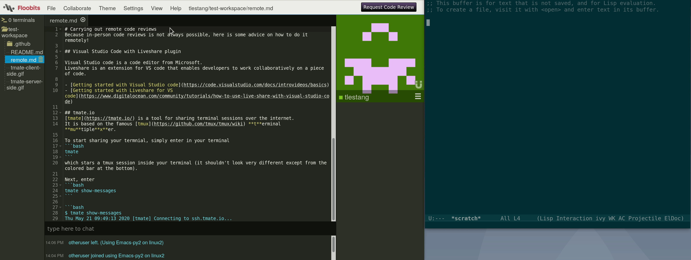

# Useful tools for remote code reviews
Face to face code reviews are currently not possible.
Anyhow, there are many solutions to share code over the internet!

- [Visual Studio Code with Live share plugin](#Visual-Studio-Code-with-Live-share-plugin)
- [tmate](#tmate)
- [Floobits](#Floobits)
- [jitsi for videoconferencing](#jitsi-for-videoconferencing)

## Visual Studio Code with Live share plugin

Visual Studio code is a code editor from Microsoft.
Live share is an extension for VS code that enables developers to work collaboratively on a piece of code.

- [Getting started with Visual Studio code](https://code.visualstudio.com/docs/introvideos/basics)
- [Getting started with Live share for VS code](https://www.digitalocean.com/community/tutorials/how-to-use-live-share-with-visual-studio-code)

### License and privacy
Although the source code for VS code is provided with an open source license (MIT), the binary provided by Microsoft is not.
[The VScodium project](https://vscodium.com/) provides builds of VS code released under the MIT license. Particularly, the telemetry included in the binary provided by Microsoft is disabled.

Similarly to VS code, the Live Share extension binary is proprietary software.
The corresponding license can be found [here](https://marketplace.visualstudio.com/items/MS-vsliveshare.vsliveshare/license).


## tmate.io
[tmate](https://tmate.io/) is a tool for sharing terminal sessions over the internet.
It is based on the famous [tmux](https://github.com/tmux/tmux/wiki) **t**erminal **mu**tiple**x**er.

To start sharing your terminal, simply enter in your terminal
```bash
tmate
```
which starts a tmux session inside your terminal (it shouldn't look very different except from the coloured bar at the bottom).

Next, enter
```bash
tmate show-messages
```

```bash
$ tmate show-messages
Thu May 21 09:49:13 2020 [tmate] Connecting to ssh.tmate.io...
Thu May 21 09:49:13 2020 [tmate] Note: clear your terminal before sharing read-only access
Thu May 21 09:49:13 2020 [tmate] web session read only: https://tmate.io/t/ro-j2nMRX7qmFJePwDgNmvEWC4uQ
Thu May 21 09:49:13 2020 [tmate] ssh session read only: ssh ro-j2nMRX7qmFJePwDgNmvEWC4uQ@lon1.tmate.io
Thu May 21 09:49:13 2020 [tmate] web session: https://tmate.io/t/daSqRGCWXcZkyc9WunwebVXye
Thu May 21 09:49:13 2020 [tmate] ssh session: ssh daSqRGCWXcZkyc9WunwebVXye@lon1.tmate.io
$
```

To share your terminal, simply share one of the addresses with your collaborator.
For instance, for your collaborator to see your terminal live, their must enter
```bash
ssh ro-j2nMRX7qmFJePwDgNmvEWC4uQ@lon1.tmate.io
```
in theirs.
To view it in a web browser, they can visit `https://tmate.io/t/ro-j2nMRX7qmFJePwDgNmvEWC4uQ`.

- **ssh session read only** (recommended): Join the session through `ssh`, read only mode.
- **web session read only** (most straightforward solution): View terminal through a web browser. Still a bit unstable but when it works, it's great!
- **ssh session read only**: Join the session through `ssh`. The collaborator has write-access to your terminal, and can therefore execute commands on your system!
- **web session** (not recommended): Allow access to your collaborator to your terminal through a web browser.

**Starting and sharing a tmate session**:


**Joining a tmate session using ssh:**


### Access denied. Check your ssh keys
To use tmate over ssh, each participant must have their pair of ssh keys set up.

Here's [a guide](https://www.digitalocean.com/community/tutorials/how-to-set-up-ssh-keys-on-ubuntu-1804) on how to do it (*only step 1 is required for using tmate*).

### License and privacy
tmate is released under a free and opens source license (BSD)
Terminal sharing using tmate makes use of the tmate.io servers that act as a proxy between you and your collaborator(s).
The server side of tmate is licensed under the MIT license.

## Floobits
Flootbits (https://floobits.com/) let you share and collaboratively edit code over the internet.
It works through a system of work-spaces that users can join.

The main feature of Floobits is that the service can be used with several widespread text editors: Emacs, Vim(NeoVim), Atom, Sublime and IntelliJ.
In a code review context, this means that both the author and reviewer(s) can work on the code synchronously, each using their favourite text editor.

Setting up Floobits for a specific editor may require some initial setting up.
A very nice alternative is to use the Floobits web-based editor, directly in the web browser. 

Here is an illustration of Floobits where user `otheruser` joins user `tlestang`'s workspace. The former is using the web-based Floobits editor, whilst the latter uses Emacs.



Floobits provides useful features for code reviews and pair programming in general.
Particularly, is possible to "follow" the cursor of another user. If they change file, you will too.

### Getting started with Floobits
1. Create an account on (https://floobits.com/)
2. To share your code, create a workspace and synchronise your local files with it. From the web-editor, *File* -> *Add files*. This can also be done from your local editor.
3. Files on work-spaces are read-only by default. To grant write permission to another user, go to your Floobits settings page and update your work-space's settings: *Settings* -> *Edit Permissions*.
4. You can join any public workspace (or private if you were added to it) from your text editor. To join a workspace from the web-based editor, the workspace owner must first add you to it. Then in your Floobits profile, click on *Edit code*.

### License and privacy
Floobits plugins are free/libre and open source software, licensed under the Apache 2.0 license.
Floobits' privacy policy can be found at (https://floobits.com/privacy).

## jitsi for videoconferencing
[jitsi-meet](https://meet.jit.si/) is a web-based free/libre and open source video conferencing app.
